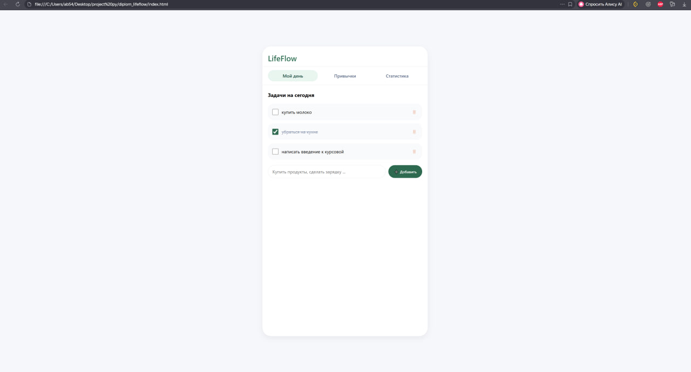
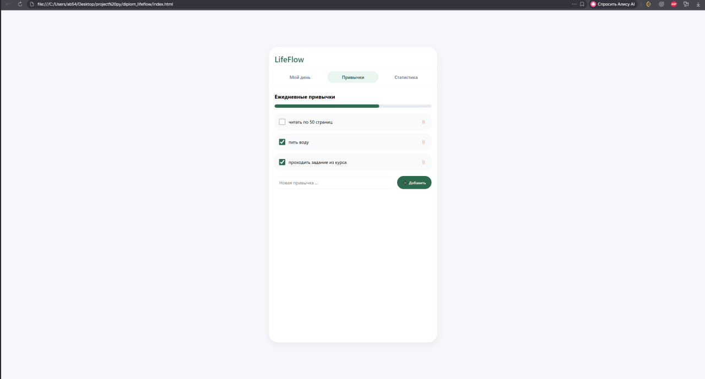
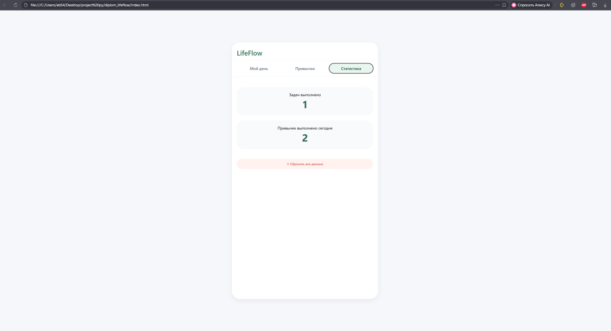

---

## Задание 1: Описание дипломного проекта

В документе `Задание 1.docx` отражены:
- **Актуальность темы:** потребность в простом инструменте для планирования задач без избыточного функционала.
- **Целевая аудитория:** студенты, фрилансеры, люди с рутинными делами.
- **Функциональные возможности:** 3 экрана (задачи, привычки, статистика).
- **Используемые технологии:** HTML/CSS/JS, localStorage.
- **Ожидаемый результат:** рабочий веб-сайт с сохранением данных в браузере и готовностью к интеграции с бэкендом.

---

## Задание 2: Use-case диаграмма

## Изображение

## Акторы
- **Пользователь** — базовый функционал (задачи и привычки)
- **Продвинутый пользователь** — статистика и сброс данных

## Варианты использования
- Добавить задачу
- Отметить задачу выполненной
- Удалить задачу
- Просмотреть список задач
- Добавить привычку
- Отметить выполнение привычки
- Просмотреть прогресс привычек
- Сбросить все данные
- Просмотреть статистику

---

## Задание 3: Интерфейс и клиентская логика

### Реализованные экраны

| Экран | Функционал | Статус |
| :--- | :--- | :--- |
| **Мой день** | Добавление, отметка, удаление задач. Хранение в localStorage. | ✅ |
| **Привычки** | Добавление привычек, отметка на сегодня, прогресс-бар. | ✅ |
| **Статистика** | Подсчёт выполненных задач и привычек за сегодня, кнопка сброса. | ✅ |

### Скриншоты интерфейса

| Мой день | Привычки | Статистика |
| :---: | :---: | :---: |
|  |  |  |

### Адаптивность
- Поддержка мобильных экранов (медиазапросы, гибкая верстка)
- Корректное отображение на ширине от 320px до 1920px

### Клиентская логика (JavaScript)
- Хранение данных в `localStorage`
- Динамическая отрисовка списков задач и привычек
- Обработка событий (добавление, удаление, отметка выполнения)
- Подсчёт статистики в реальном времени
- Валидация ввода (пустые строки не добавляются)
- Защита от XSS (экранирование спецсимволов)

### Запуск проекта
1. Скачать или склонировать репозиторий
2. Открыть файл `index.html` в любом современном браузере
3. Данные автоматически сохраняются в браузере и не исчезают после перезагрузки страницы

---

## Контакты
**Студент:** Мороз Варвара  
**Группа:** 01-233.ИСИП.ОД.9  
**Руководитель:** Сизов Сергей Евгеньевич 
**Год:** 2026
