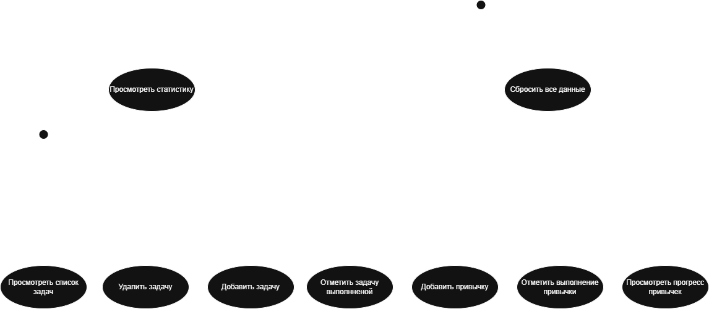

# Use-case диаграмма

## Изображение

## Акторы
- **Пользователь** — базовый функционал (задачи и привычки)
- **Продвинутый пользователь** — статистика и сброс данных

## Варианты использования
- Добавить задачу
- Отметить задачу выполненной
- Удалить задачу
- Просмотреть список задач
- Добавить привычку
- Отметить выполнение привычки
- Просмотреть прогресс привычек
- Сбросить все данные
- Просмотреть статистику
